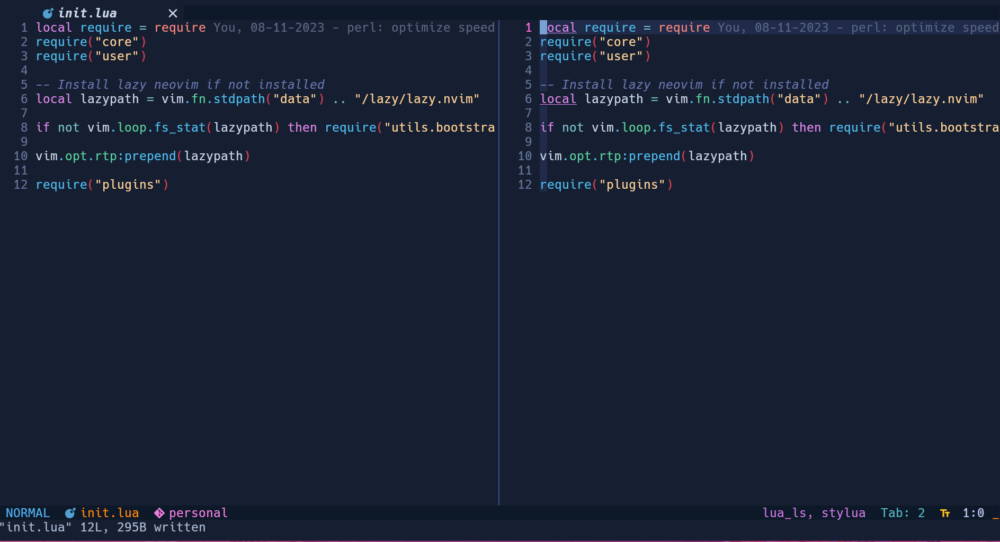

The main theme for [stinvim](https://github.com/sontungexpt/stinvim)

Easy to use, easy to config, easy to extend.

## Features

🤩 Beautiful colorscheme.

😁 Support for many themes, including: dark, light, and more(coming soon).

🤔 Easy to config, easy to extend.

😆 Witch boasts robust support for loading customized syntax highlighting tailored to specific filetypes, buftypes, events

😁 Easy to switch between themes easily with `:Witch <theme_name>` command

👀 Try to load highlighting incrementally to hopefully reduce the time it takes to load the neovim

## Preview

The colors in the preview may appear different from those in your Vim due to potential errors during color conversion



https://github.com/sontungexpt/witch/assets/92097639/ebf730fc-3218-427f-b8a5-ae0fa5895532

## Installation

```lua
    -- lazy
    {
        "sontungexpt/witch",
        priority = 1000,
        lazy = false,
        config = function(_, opts)
            require("witch").setup(opts)
        end,
    },

```

## Options

```lua
    require("witch").setup {
        theme = {
            -- default style of the theme
            -- "dark", "light"
            style = "dark",

            -- more module that you want it should be loaded
            extras = {
                -- bracket = true,
                -- dashboard = true,
                -- diffview = true,
                -- explorer = true,
                -- indentline = true,
            },

            -- custome your highlight module
            -- see: witch.theme.example
            customs = {
                -- require("witch.theme.example"),
            },

            -- This function is called when witch starts highlighting.
            -- It provides a unique opportunity to modify the default highlight groups.
            -- If you wish to customize the default highlight groups, you can do so here.
            -- This function is invoked after loading all colors and highlight options
            -- but before applying the highlights, allowing users to adjust undesired highlights.
            -- you can do something like this
            --
            -- on_highlight = function(style, colors, highlight)
            -- 	if style == "dark" then
            -- 		-- change the default background of witch
            -- 		colors.bg = "#000000"

            -- 		-- change the Normal highlight group of witch
            -- 		highlight.Normal = { fg = "#ffffff", bg = "#000000" }
            -- 	elseif style == "light" then
            -- 		-- change the default background of witch
            -- 		colors.bg = "#ffffff"

            -- 		-- change the Normal highlight group of witch
            -- 		highlight.Normal = { fg = "#000000", bg = "#ffffff" }
            -- 	end
            -- end,

            --- @param style string : the current style of the theme
            --- @param colors table : the current colors of the theme
            --- @param highlight table : the current highlights of the theme
            on_highlight = function(style, colors, highlight)
            end,
        },

        -- dims inactive windows
        dim_inactive = {
            enabled = true,
            -- from 0 to 1
            -- as nearer to 1 the dimming will be lighter
            level = 0.48,

            -- Prevent dimming the last active window when switching to a window
            -- with specific filetypes or buftypes listed in the excluded table.
            --
            -- The idea of this option is when change to a window like NvimTree, Telescope, ...
            -- where these windows are considered auxiliary tools.
            -- the last active window retains its status as the main window
            -- and should not be dimmed upon switching.
            excluded = {
                filetypes = {
                    NvimTree = true,
                },
                buftypes = {
                    nofile = true,
                    prompt = true,
                    terminal = true,
                },
            },
        },

        -- true if you want to use command StinvimUISwitch
        switcher = true,

        -- add your custom themes here
        more_themes = {

            -- the key is the name of the theme must be in PascalCase
            -- the value is the table of colors to be passed to the theme
            -- with following format in witch.colors.example
            -- Custom1 = {},
            -- Custom2 = {},
        },
    }
```

## Commands

| Command               | Description                                                           |
| --------------------- | --------------------------------------------------------------------- |
| `:Witch <theme_name>` | Switch to the specified theme, fallback to default theme if not found |

## Events

| Event                | Description                                                                                                                                       |
| -------------------- | ------------------------------------------------------------------------------------------------------------------------------------------------- |
| `WitchHighlightDone` | This event is fired when witch has finished highlighting. You can use this to reload highlight of some plugin such as NvimTree after change theme |

## Custom Highlight

With witch, you can easily add your custom highlight to the theme
by creating a new module in some where in your config and add it to the `customs` option.

The module should has the structure like this: [example](./lua/witch/theme/example.lua)

```lua
    require("witch").setup {
        theme = {
            customs = {
                -- your module
                require("witch.theme.example"),
                -- ...
            },
        },
    }
```

🤗 We also provide some default highlight module that you can use to extend the theme
see [here](./lua/witch/theme/extra).
So to enable these module, you can add the name of module to the `extras` option

```lua
    require("witch").setup {
        theme = {
            extras = {
                bracket = true,
                dashboard = true,
                diffview = true,
                explorer = true,
                indentline = true,
            },
        },
    }
```

## Custom Theme

With witch, you can also add your custom theme to the theme.

😢 Unfortunately, it's not really flexible you just can change the colors of the
table colors rigidly.

You can see the colors format in [here](./lua/witch/colors/example.lua)

So, if you have any idea to make it more flexible, please let me know.

```lua
    require("witch").setup {
        more_themes = {
            -- the key is the name of the theme must be in PascalCase
            Custom1 = {
                bg = "#161f31", -- the background color
                bg_dark = "#0d1829", -- the background color of floating windows
                bg_line = "#0d1829", -- the background color of the statusline and tabline
                bg_visual = "#253557", -- the background color of the visual selection
                bg_highlight = "#1f2b49", -- the background color of the line the cursor is on
                bg_gutter = "#1b305d", -- the background color of fold
                bg_sidebar = "#1b305d", -- the background color of the sidebar, fallback to bf_dark if not defined

                fg = "#c9d8ee", -- the foreground color
                fg_dark = "#a9bad6", -- the foreground color of floating windows
                fg_sidebar = "#a9bad6", -- the foreground color of the sidebar, fallback to fg_dark if not defined

                yellow = "#f0a421",
                yellow1 = "#e6cc4c",
                bright_yellow = "#ffc021",

                red = "#dc4154",
                red1 = "#ff5874",
                red2 = "#ee4c96",

                cyan = "#7dcfff",
                cyan1 = "#75c8cc",

                black = "#000000",
                white = "#ffffff",

                green = "#5bcf75",

                orange = "#f99635",
                orange1 = "#f78c6c",
                orange2 = "#f78782",
                light_orange = "#ffd59d",

                blue = "#50bcef",
                blue1 = "#629df2",
                blue2 = "#698ff1",

                link = "#8bdafe",

                teal = "#5cd0a0",

                gray = "#596683",
                graphite = "#738eaf",
                light_gray = "#64739a",

                pink = "#f36cde",
                pink1 = "#ed66c2",

                purple = "#b278ea",

                brown = "#c17e70",

                magenta = "#da87ea",
                magenta1 = "#ff3483",

                border = "#3d88c4",
                dark_border = "#37518d",
                graphite_border = "#465968",

                comment = "#6675ae", -- the color of comments
                string = "#ffd39b", -- the color of strings
                operator = "#7bc0cc", -- the color of operators

                error = "#e64152",
                info = "#59d1f2",
                warn = "#ffcb44",
                hint = "#1abc9c",
                todo = "#f78c6c",
                unnecessary = "#375172",

                -- if you want to change the terminal colors, you can do so here
                -- the term_0 - term_15 colors has the priority over the term_black - term_bright_white colors
                term_0 = "#000000",
                term_8 = "#4d4d4d",

                term_7 = "#ffffff",
                term_15 = "#ffffff",

                term_1 = "#fc3753",
                term_9 = "#fc3753",

                term_2 = "#37a16f",
                term_10 = "#4ad860",

                term_3 = "#f0a421",
                term_11 = "#f0a421",

                term_4 = "#1e9eff",
                term_12 = "#1e9eff",

                term_5 = "#f36cde",
                term_13 = "#f36cde",

                term_6 = "#7dcfff",
                term_14 = "#7dcfff",

                term_black = "#000000",
                term_bright_black = "#4d4d4d",

                term_white = "#ffffff",
                term_bright_white = "#ffffff",

                term_red = "#fc3753",
                term_bright_red = "#fc3753",

                term_green = "#4ad860",
                term_bright_green = "#4ad860",

                term_yellow = "#f0a421",
                term_bright_yellow = "#f0a421",

                term_blue = "#1e9eff",
                term_bright_blue = "#1e9eff",

                term_magenta = "#f36cde",
                term_bright_magenta = "#f36cde",

                term_cyan = "#7dcfff",
                term_bright_cyan = "#7dcfff",
            },

            Custom2 = {
                -- your colors
            },
        },
    }
```

## License

[MIT](./LICENSE)
